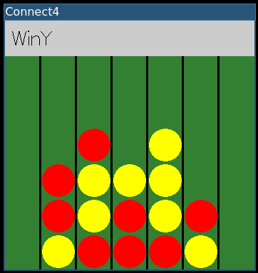

# Connect4

## Interface console

```
$ stack run connect4-cli 
usage: connect4-cli bot

bots: 
  random
  mc-<nsims>
  mcts-<nsims>
  negamax-<nsims>
  negamaxab-<nsims>

$ stack run connect4-cli mc-100
...

0123456
..R....
..RY...
..YY...
..YRY..
..RRYY.
.RYRRRY
moves: 0 1 3 4 5 6
status: WinY

new game (y/n) ?
```

## Interface graphique

```
$ stack run connect4-gui
usage: connect4-gui botR botY

bots: 
  human
  random
  mc-<nsims>
  mcts-<nsims>
  negamax-<nsims>
  negamaxab-<nsims>

$ stack run connect4-gui human mcts-500
```




## Comparaison d'IA

```
$ stack run connect4-cmp
usage: connect4-cmp nGames botR botY

bots: 
  random
  mc-<nsims>
  mcts-<nsims>
  negamax-<nsims>
  negamaxab-<nsims>

$ stack run connect4-cmp 100 mc-100 mcts-500
winR WinY tie ry ryt dt nGames botR botY
0.39 0.61 0.0 1.0 1.0 4.852495919 100 mc-100 mcts-500
```

