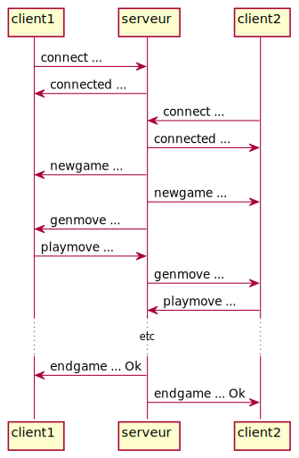
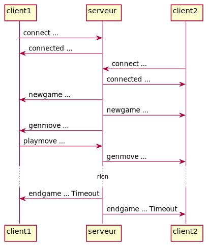

# Protocole réseau pour Puissance 4 


## Résumé

Il s'agit d'un protocole de communication réseau qui permet de confronter des
joueurs de Puissance 4 (serveur unique, clients multiples). Quand un client se
connecte au serveur, il y a une étape de connexion puis le serveur le contacte
pour initier et dérouler des parties de jeu. Un client ne joue qu'à une seule
partie à la fois. Le serveur gère les parties en essayant de faire jouer tous
les clients entre eux. Les clients doivent donc rester connectés en attendant
qu'une partie soit lancée (ou qu'un nouveau client arrive).

[exemple d'implémentation](https://github.com/nokomprendo/not-a-connect4)


## Généralités

- communication par websocket

- messages textes (terminant par "\r\n")

- une partie débute avec un temps de réflexion donné (par exemple, 42.0s pour
  chaque joueur)

- le temps restant au joueur pour la partie est indiqué quand le serveur
  demande de jouer un coup

- si un client joue un coup invalide, le serveur lui redemande de jouer et
  compte une pénalité de temps (par exemple, 1.0s) en plus du temps consommé

- en cas de timeout, le serveur envoie un message de fin de partie aux deux
  joueurs (le joueur timeout perd la partie); le serveur peut éventuellement
  relancer une autre partie ensuite

- en cas de déconnexion d'un client qui joue, il perd la partie


## Protocole

[Augmented Backus–Naur form](https://en.wikipedia.org/wiki/Augmented_Backus%E2%80%93Naur_form)

```
message     = message-connect               ; client ----> serveur
            / message-connected             ; client <---- serveur
            / message-notconnected          ; client <---- serveur
            / message-newgame               ; client <---- serveur
            / message-genmove               ; client <---- serveur
            / message-playmove              ; client ----> serveur
            / message-endgame               ; client <---- serveur


message-connect         = "connect" SP user CRLF

message-connected       = "connected" [SP info] CRLF

message-notconnected    = "not-connected" [SP info] CRLF

message-newgame         = "newgame" SP user SP user CRLF    

message-genmove         = "genmove" SP board SP color SP status SP time CRLF

message-playmove        = "playmove" SP move CRLF

message-endgame         = "endgame" SP board SP color SP status SP battlestatus CRLF


user            = *(ALPHA / DIGIT / "-" / "_")

info            = *(ALPHA / DIGIT / SP)

board           = 42*("." / color)      ; ligne 0, ligne 1, etc

color           = "R" / "Y"             ; couleur du client qui reçoit le message

time            = *DIGIT "." DIGIT

move            = "0" / "1" / "2" / "3" / "4" / "5" / "6"   ; numéro de la colonne

status          = "WinR" / "WinY" / "Tie" / "PlayR" / "PlayY"

battlestatus    = "Ok" / "Timeout" / "Disconnected"
```


## Discussion

Le client peut gérer son temps au cours de la partie, par exemple en estimant
le nombre de coups potentiels restant.

Après l'étape de connexion, le client répond aux messages `genmove` du serveur.
Cependant comme le serveur vérifie le temps, celui-ci peut envoyer un `endgame`
à tout moment et recommencer une nouvelle partie peu de temps après.
Typiquement, le client implémentera donc le calcul d'un coup dans un thread
spécifique, qu'on interrompera en cas de timeout.


## Exemples

### Séquence ok



```
connect client1
connected hello client1
connect client2
connected hello client2
newgame client1 client2
newgame client1 client2
genmove .......................................... R 21.0
playmove 1
genmove .R........................................ Y 21.0
playmove 1
...
endgame .RRRR...YYY............................... R WinR Ok
endgame .RRRR...YYY............................... Y WinR Ok
```


### Séquence avec timeout



```
connect client1
connected hello client1
connect client2
connected hello client2
newgame client1 client2
newgame client1 client2
genmove .......................................... R 21.0
playmove 1
genmove .R........................................ Y 21.0

endgame .R........................................ R WinR Timeout
endgame .R........................................ Y WinR Timeout
```


