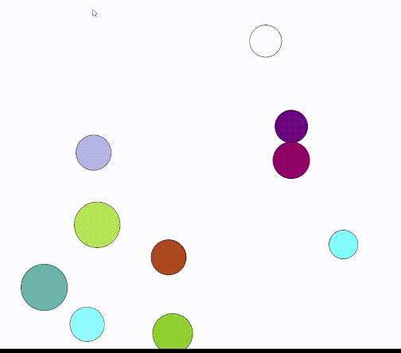

# Balles rebondissantes en Scala

*Note: la faible fréquence d'image ne vient pas du jeu mais du matériel utilisé pour l'enregistrement du gif*

Voici un exemple du défi n°10 écrit en Scala.

Le code est entièrement documenté via une Scaladoc en anglais (voir le code).

# Lancer l'exemple

Vous pouvez exécuter le projet avec la commande suivante: `sh millw -i main.run`

# Architecture globale

## Dépendances

Le projet utilise la bibliothèque graphique [Doodle](https://github.com/creativescala/doodle/) et
[Cats](https://typelevel.org/cats/), gérées par le build tool Mill.

## Architecture du jeu

Le projet adopte une approche fonctionnelle: chaque état d'une entité est une case class immuable et la boucle de jeu
est une fonction qui va prendre en parmètre l'état actuel pour en retourner un nouveau.

Bien que l'architecture des jeux soit souvent très orientée objets, la programmation fonctionnelle apporte également
son lot d'avantages:
- Le jeu peut être décrit comme un simple pipeline avec une entrée et un résultat
- Pas de side-effect, ce qui est très pratique pour gérer les états:
  - prévenir les débordements lors du calcul du prochain tick
  - pouvoir potentiellement rollback vers un état plus ancien

Il s'agit également de l'approche prise par le moteur de jeu [Indigo](https://indigoengine.io/)

# Physiques des boules

Le déplacement des boules est simplement gérée par une vélocité représentée par un vecteur, ajouté à la position chaque
tick de jeu.

Le jeu n'utilise qu'un système de vecteurs. Aucun angle n'est utilisé.

## Gestion des collisions

Toutes les collisions (boules et bords de la fenêtre) utilisent le calcul du
[Choc Élastique](https://fr.wikipedia.org/wiki/Choc_%C3%A9lastique)
([Page anglaise](https://en.wikipedia.org/wiki/Elastic_collision)).

Voici le calcul du choc élastique entre deux objets en mouvement (version utilisant des vecteurs):

## Gravité

La Gravité est une simple décrémentation de la valeur Y du vecteur vélocité.

Vous pouvez changer le vecteur vélocité dans [l'instance Ticker\[Ball\]](https://github.com/NotANameServer/challenges/blob/master/defi10/scala/iltotore/main/src/io/github/iltotore/ball/package.scala#L31) 